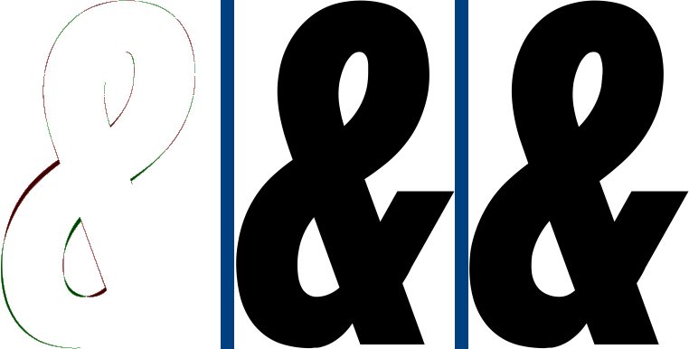
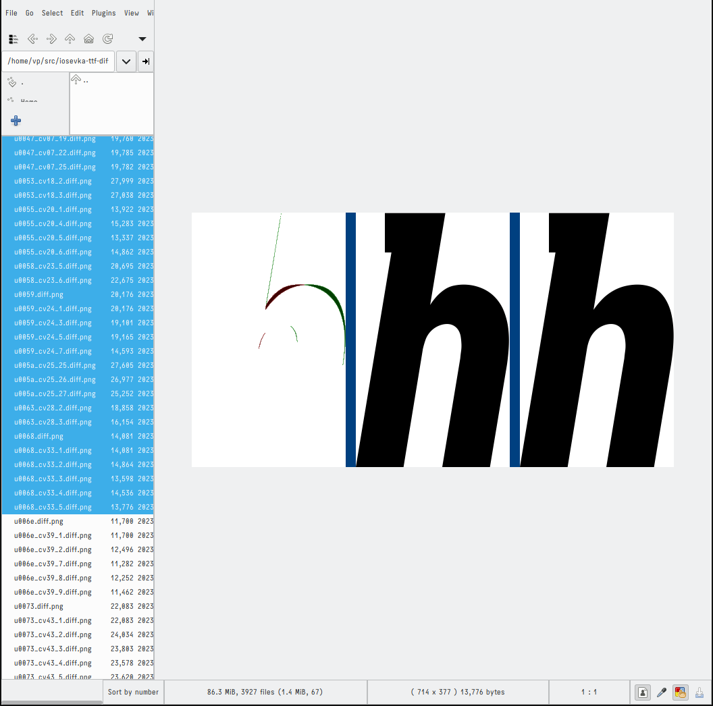

# Iosevka ttf diff

- [Building](#building)
- [Running](#running)
  - [Getting help](#getting-help)
  - [Output format](#output-format)
  - [Argument options](#argument-options)
    - [Render size (-renderSize=N)](#render-size--rendersizen)
    - [Output target (-outputTarget=type:extra)](#output-target--outputtargettypeextra)
    - [Output select (-outputSelect=type,...)](#output-select--outputselecttype)
    - [Accuracy (-accuracy=N)](#accuracy--accuracyn)
    - [Advanced logging (-logKept)](#advanced-logging--logkept)
- [Using](#using)
  - [Choosing ttf files to compare](#choosing-ttf-files-to-compare)
  - [Running iosevka-ttf-diff](#running-iosevka-ttf-diff)
  - [Removing false-positives](#removing-false-positives)
  - [Reporting the remaining diffs upstream](#reporting-the-remaining-diffs-upstream)
  - [Checking whether the diffs were fixed with a new version](#checking-whether-the-diffs-were-fixed-with-a-new-version)

## Building

The requirements are:
- `harfbuzz 3.2.x`,
- `freetype 2.11.1` (pkg-config version `24.1.x`),
- `libpng 1.6.x`,
- some C compiler (by default `cc` is used).

The minimal dependency check is done during build process.

No separate configure/install stages are supported.

To build the executable run the following:

```sh
$ make -C src
```

Tested on `Slackware 15.0` with `gcc 11.2.0` but other linux distros, other unix-like systems (like *BSD) and previous versions of compiler/`Slackware` should work fine too. Please report if they don't.

## Running

### Getting help

To get brief help run
```sh
./src/iosevka-ttf-diff -help
```

### Output format

The only required arguments are the paths to the "old" ttf file and to the "new" one. Of course you can compare any two versions of Iosevka or even two different variants (e.g. Iosevka-ss01 and Iosevka-curly-slab). In any case the first path is considered as the "old" version and the second path is considered as the "new" version.

The output consists of a "process log" and "difference images" (or "diff images").

The process log describes:
- progress (percentage) of the process (e.g. `36.811 %`),
- glyph and glyph variant being processed (e.g. `u1f196.cv07=19` or `u1f196.default`),
- glyph operation:
  - `kept` for glyph variants present in both the old and the new ttfs and considered as having the same shape,
  - `changed` for glyph variants present in both the old and the new ttfs but considered as having different shapes,
  - `added` for glyph variants only present in the new ttf,
  - `deleted` for glyph variants only present in the old ttf,
- glyph identifier inside the ttf file (not much meaningful, just for debugging).

The difference image is an image consisting of three columns:
- the "difference" glyph,
- the old glyph variant shape,
- the new glyph variant shape.

### Argument options

#### Render size (-renderSize=N)

Default: 512.

Render size sets the value passed to `freetype`/`harfbuzz` glyph rendering functions, related to font size. The bigger argument value the bigger font-size.

I'm not sure what exactly it means (em-size or whatever) but the default of 512 seems enough for png output.

#### Output target (-outputTarget=type:extra)

By default the diff images are written to the standard output in text format.

It's possible to generate png diff images instead by providing `-outputTarget` option with `type` equal to `png` and `extra` equal to the prefix of png images to be generated.

E.g. the command
```sh
./src/iosevka-ttf-diff -outputTarget=png:./diff-pngs/regular/ ./iosevka-regular.ttf.old ./iosevka-regular.ttf
```
creates the diff images in directory `diff-pngs/regular` with names like e.g. `u04f3_cv49_6.diff.png` or `u1d639.diff.png`.

The command
```sh
./src/iosevka-ttf-diff -outputTarget=png:./diff/regular- ./iosevka-regular.ttf.old ./iosevka-regular.ttf
```
creates the diff images in directory `diff` with names starting with `regular-`, e.g. `regular-u04f3.diff.png` or `regular-u1d63a_cv49_12.diff.png`.

No directories are created by `iosevka-ttf-diff`. If some directories need to be created they must be created before by the user.

The png diff images contain 3 columns separated by two blue lines:
1. difference between columns 2 and 3:
   - red is what only present in column 2 (the old glyph variant shape),
   - green is what only present in column 3 (the new glyph variant shape),
   - white marks areas equal in column 2 and column 3,
2. the old glyph variant shape,
3. the new glyph variant shape.

#### Output select (-outputSelect=type,...)

Don't mind. Currently only `diff` is supported and is the default value.

Allows to select what images to output:
- `diff` for rendering diff images,
- `new` for rendering images of glyph variants only present in the new ttf,
- `old` for rendering images of glyph variants only present in the old ttf.

Multiple values can be provided separated by commas.

#### Accuracy (-accuracy=N)

Default: 5.

Comparing glyph shapes is not a trivial task. Theoretically two shapes could differ in a single pixel just because different library versions were used to generate the ttfs being compared. Should we consider these glyphs as different or not?

To solve the problem `iosevka-ttf-diff` allows to determine the criteria to decide whether two glyphs are different or not.

Two glyph shapes are considered as different if they have at least one square area with no pixels in it having the same value in the both shapes.  The size of the area is the integer value provided in `-accuracy=N` option argument.

For exact matching (pixel-by-pixel) use `-accuracy=1`. This is not recommended as producing too many "false positives".

The recommended values are (for weights from `regular` to `heavy`):
- `3` to detect minor meaningful differences in the shapes,
- `5` to detect non-minor meaningful differences.

E.g. if provided `-accuracy=5` the shapes considered as different only if there is a 5x5 pixel square area which we can traverse through and detect no pixel in this area of the old glyph shape that has the same color (intensity, value) as the corresponding pixel in the new glyph shape.

#### Advanced logging (-logKept)

By default only the changes get to the log. Adding `-logKept` leads to any progress getting to the log including glyph variants that were not changed between the old version and the new one.

### Warning

Be careful when choosing parameters. The current `iosevka-ttf-diff` implementation has no out-of-bounds checking so huge values can lead to bugs and even vulnerabilities.

Fixing this is on my TODO list.

## Using

This section describes how I personally prefer to use `iosevka-ttf-diff`.

Extra software used:
- `geeqie`,
- `uxterm` (or any other terminal emulator).

Building Iosevka on my hardware is a long task so it's easier to use the release archives from Iosevka github (after successfull testing you can build your own variants of course).

### Choosing ttf files to compare

`iosevka-ttf-diff` only supports comparing ttf font files.

First, it's highly recommended using unhinted ttf versions e.g. `ttf-unhinted-iosevka-18.0.0.zip` or `ttf-unhinted-iosevka-slab-18.0.0.zip`.

Second, comparing all the weights requires too much time. It's recommended only comparing one of:
- `regular` as the most used (I guess),
- `heavy` as probably having more problems than other weights because more glyph ("non-empty") pixels must properly fit in the same glyph area without loss of readability.
- `thin` (the least recommended) as having more issues with accuracy of connecting different glyph stems: where "misconnects" can be unnoticable on `regular` or `heavy` weights the same "misconnects" would create obvious issues with thinner stems of `thin` weight.

Third, many `italic` and `slab` (and `slab-italic`) glyph shapes differ from the `upright`/`sans` shapes of the same glyphs. So it's also recommended testing at least 4 files: base, base-italic, base-slab, base-slab-italic.

E.g. I personally prefer testing 4 files:
- ttf-unhinted-iosevka.zip: iosevka-regular.ttf
- ttf-unhinted-iosevka.zip: iosevka-italic.ttf
- ttf-unhinted-iosevka-slab.zip: iosevka-slab-regular.ttf
- ttf-unhinted-iosevka-slab.zip: iosevka-slab-italic.ttf

Or the similar set based on `heavy`/`heavyitalic` weight instead of `regular`/`italic`.

Unpack the files and format their names in a similar way, including their versions:
```sh
$ ls iosevka-*
iosevka16.3.6-sans-italic.ttf
iosevka16.3.6-sans-regular.ttf
iosevka16.3.6-slab-italic.ttf
iosevka16.3.6-slab-regular.ttf
iosevka18.0.0-sans-italic.ttf
iosevka18.0.0-sans-regular.ttf
iosevka18.0.0-slab-italic.ttf
iosevka18.0.0-slab-regular.ttf
```

### Running iosevka-ttf-diff

`iosevka-ttf-diff` is single-threading. On my 4-core hardware I can run 4 instances at the same time, exactly one instance per ttf file (see the previous section).

First create 4 directories:
```sh
$ mkdir ./{sans,slab}-{italic,regular}
```

Then start 4 processes in different `uxterm` instances:
```sh
1$ ./src/iosevka-ttf-diff -logKept -renderSize=512 -accuracy=5 -outputTarget=png:./sans-italic/ ./iosevka{16.3.6,18.0.0}-sans-italic.ttf
2$ ./src/iosevka-ttf-diff -logKept -renderSize=512 -accuracy=5 -outputTarget=png:./sans-regular/ ./iosevka{16.3.6,18.0.0}-sans-regular.ttf
3$ ./src/iosevka-ttf-diff -logKept -renderSize=512 -accuracy=5 -outputTarget=png:./slab-italic/ ./iosevka{16.3.6,18.0.0}-slab-italic.ttf
4$ ./src/iosevka-ttf-diff -logKept -renderSize=512 -accuracy=5 -outputTarget=png:./slab-regular/ ./iosevka{16.3.6,18.0.0}-slab-regular.ttf
```

Or using default options where suported:
```sh
1$ ./src/iosevka-ttf-diff -logKept -outputTarget=png:./sans-italic/ ./iosevka{16.3.6,18.0.0}-sans-italic.ttf
2$ ./src/iosevka-ttf-diff -logKept -outputTarget=png:./sans-regular/ ./iosevka{16.3.6,18.0.0}-sans-regular.ttf
3$ ./src/iosevka-ttf-diff -logKept -outputTarget=png:./slab-italic/ ./iosevka{16.3.6,18.0.0}-slab-italic.ttf
4$ ./src/iosevka-ttf-diff -logKept -outputTarget=png:./slab-regular/ ./iosevka{16.3.6,18.0.0}-slab-regular.ttf
```

### Removing false-positives

Running `iosevka-ttf-diff` even with (practically) large accuracy can still create many diff images that generally show no difference:



Unfortunatelly currently I see only one way to deal with those: removing them by hand via some image viewer with needed behavior (like `geeqie 1.7.2` from `Slackware 15.0`).

Run the image viewer
```sh
$ cd ./sans-italic
$ geeque $PWD
```
and focus the first file in the filelist to look at the diff image.

Then
- if the current diff image looks good (not worth reporting upstream) press `shift+down` to select next one,
- if the current diff looks worth reporting upstream or you are unsure if it is
  - if there are already selected diffs press `shift+up` to unselect the current (bad) diff, followed by `delete` to delete the diffs selected before,
  - press `down` to go to the next diff image to take decision.

By the end of this process only diff images are kept that either
- worth reporting,
- should be reviewed/deeper researched on whether they should be reported.



### Reporting the remaining diffs upstream

The remaining diffs can be reported upstream.

### Checking whether the diffs were fixed with a new version

After a new version is released:
- repeat the process described above,
- ensure that all the diff images remaining after the previous process are also created during the current process and have the expected changes.
